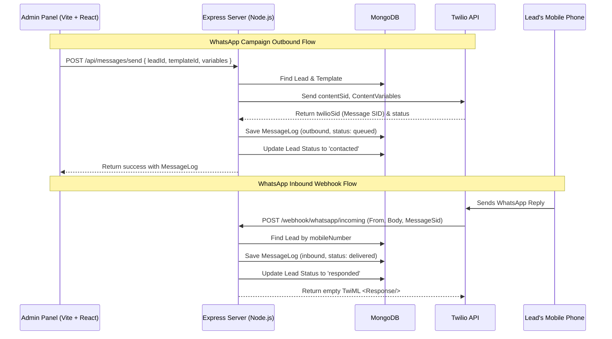
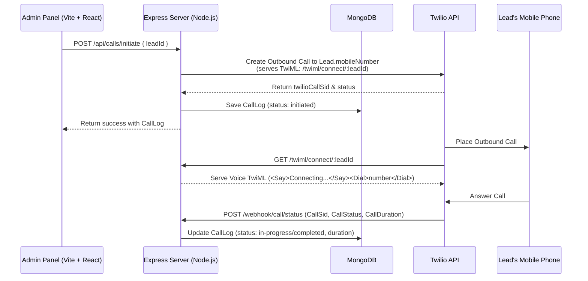

# EzCampaign 🚀

EzCampaign is a state-of-the-art, full-stack **WhatsApp Campaign Management Dashboard** designed for administrators to manage leads, orchestrate personalized marketing campaigns, handle interactive messages, perform real-time calling, and view operational analytics. 

Built using a modern TypeScript tech stack, this application integrates seamlessly with Twilio to bridge WhatsApp template dispatches, inbound reply webhooks, and outbound calling voice TwiML loops.

---

## 📋 Table of Contents
1. [System Architecture](#-system-architecture)
2. [Tech Stack](#-tech-stack)
3. [Quick Start & Project Setup](#-quick-start--project-setup)
4. [Environment Configuration](#-environment-configuration)
5. [Database Schema Docs](#-database-schema-docs)
6. [API Route Reference](#-api-route-reference)
7. [Frontend Screen Walkthrough](#-frontend-screen-walkthrough)
8. [Twilio & Webhook (ngrok) Configuration](#-twilio--webhook-ngrok-configuration)
9. [Docker Deployment](#-docker-deployment)
10. [Security & Compliance Checklist](#-security--compliance-checklist)

---

## 🏗 System Architecture

The following diagrams illustrate how EzCampaign orchestrates WhatsApp template communication, incoming replies, and VoIP calls:

### Outbound & Inbound WhatsApp Flow


### Voice Calling TwiML Bridge Flow


---

## 🛠 Tech Stack

- **Frontend:** [React 19](./client/package.json) + [Vite](./client/package.json) + [TailwindCSS v4](./client/package.json) + TypeScript (TSX)
- **Backend:** [Node.js](./server/package.json) + [Express](./server/package.json) + [Bun](./server/package.json) (Ultra-fast Javascript Runtime)
- **Database:** MongoDB (via [Mongoose ODM](./server/package.json))
- **Integrations:** [Twilio SDK](./server/package.json) (WhatsApp Template Messaging, Webhooks & Voice Calling)
- **Validation:** [Zod](./server/package.json) (Strict runtime input validation)

---

## 🚀 Quick Start & Project Setup

An automated setup script is provided at the root of the workspace. It automatically detects the JS package manager (preferring `bun`, falling back to `npm`), installs frontend and backend dependencies, and initializes template configuration files.

### 1. Run Automated Initialization
From the root of the project, make the setup script executable (if not already) and execute:
```bash
# Set execute permission
chmod +x setup.sh

# Run setup
./setup.sh
```

### 2. Manual Installation Steps (Alternative)
If you prefer to install dependencies manually:

**Setup Server:**
```bash
cd server
bun install # or: npm install
```

**Setup Client:**
```bash
cd client
bun install # or: npm install
```

### 3. Running Dev Servers

To run the client and server application locally:

**Start Server:**
```bash
cd server
bun run dev # or: npm run dev
```
The backend server will run at `http://localhost:8000`.

**Start Client:**
```bash
cd client
bun run dev # or: npm run dev
```
The frontend application will be hosted at `http://localhost:3000` (or the port specified by Vite).

---

## ⚙️ Environment Configuration

Create a [server/.env](./server/.env) file under the `/server` directory.

```ini
# Server Execution Profile
PORT=8000
ENDPOINT=http://localhost:8000
DEBUG_MODE=true

# Database Connection URI
DB_URI=mongodb://localhost:27017/ezcampaign

# JSON Web Token Secret Configuration (JWT)
JWT_SECRET=your_super_secret_jwt_key_at_least_32_characters
JWT_EXPIRES=24h

# Twilio Credentials Configuration
TWILIO_ACCOUNT_SID=ACXXXXXXXXXXXXXXXXXXXXXXXXXXXXXXXX
TWILIO_AUTH_TOKEN=your_twilio_auth_token
TWILIO_HOOK_ENDPOINT=https://your-ngrok-subdomain.ngrok-free.app
TWILIO_WHATSAPP=whatsapp:+911234567890
TWILIO_PHONE_NUMBER=+1234567890
```

> [!NOTE]
> - Ensure `DB_URI` points to a running MongoDB instance.
> - `TWILIO_HOOK_ENDPOINT` should contain your active `ngrok` tunnel URL to forward webhook events locally.

---

## 🗄 Database Schema Docs

The database is built on MongoDB. The tables below specify the requirements and formats for each Mongoose collection located in `server/src/models/`:

### 1. Users Collection (`users`)
Used to manage administrative and manager access profiles. Hashing is processed via Mongoose pre-save middleware hook.
- Implementation: [server/src/models/user.ts](./server/src/models/user.ts)

| Field Name | Type | Required | Description |
| :--- | :--- | :---: | :--- |
| `_id` | `ObjectId` | **YES** | Primary database key |
| `name` | `String` | **YES** | Admin display name |
| `email` | `String` | **YES** | Unique login email |
| `passwordHash` | `String` | **YES** | Bcrypt hashed password (10 salt rounds) |
| `role` | `String` | **YES** | `'admin'` or `'manager'` (Default: `'admin'`) |
| `createdAt` | `Date` | **YES** | Generated timestamp |

### 2. Leads Collection (`leads`)
Holds lead details and tags them to a mandatory business type enum. Supports soft deletes.
- Implementation: [server/src/models/lead.ts](./server/src/models/lead.ts)

| Field Name | Type | Required | Description |
| :--- | :--- | :---: | :--- |
| `_id` | `ObjectId` | **YES** | Primary database key |
| `name` | `String` | **YES** | Lead full name |
| `mobileNumber`| `String` | **YES** | Unique mobile number with country code (e.g. `+91XXXXXXXXXX`) |
| `email` | `String` | NO | Optional contact email |
| `businessType`| `String` (Enum) | **YES** | `real_estate`, `healthcare`, `education`, `ecommerce`, `finance`, `restaurant`, `travel`, `other` |
| `status` | `String` (Enum) | **YES** | `new`, `contacted`, `responded`, `converted`, `closed` (Default: `new`) |
| `notes` | `String` | NO | Optional notes |
| `assignedTemplateId` | `ObjectId` | NO | Reference to `Template` model |
| `isDeleted` | `Boolean` | **YES** | Soft delete flag (Default: `false`) |
| `createdAt` | `Date` | **YES** | Generated timestamp |
| `updatedAt` | `Date` | **YES** | Last update timestamp |

### 3. Templates Collection (`templates`)
Stores predefined Twilio Content templates associated with specific business types.
- Implementation: [server/src/models/template.ts](./server/src/models/template.ts)

| Field Name | Type | Required | Description |
| :--- | :--- | :---: | :--- |
| `_id` | `ObjectId` | **YES** | Primary database key |
| `name` | `String` | **YES** | Template display name |
| `templateSid` | `String` | **YES** | Twilio Content Template SID (e.g. `HXdc13...`) |
| `businessType`| `String` (Enum) | **YES** | Filter category matching lead businessType |
| `variables` | `Array<String>`| NO | Variable placeholders (e.g. `['name']`) |
| `sampleBody` | `String` | NO | Preview message text |
| `isActive` | `Boolean` | **YES** | Active state toggle (Default: `true`) |
| `createdAt` | `Date` | **YES** | Generated timestamp |

### 4. Message Logs Collection (`message_logs`)
Maintains WhatsApp communication logs for outbound templates and inbound replies.
- Implementation: [server/src/models/log/message.ts](./server/src/models/log/message.ts)

| Field Name | Type | Required | Description |
| :--- | :--- | :---: | :--- |
| `_id` | `ObjectId` | **YES** | Primary database key |
| `leadId` | `ObjectId` | **YES** | Reference to `Lead` model |
| `direction` | `String` (Enum) | **YES** | `'outbound'` or `'inbound'` |
| `templateSid` | `String` | NO | Only present on outbound template messages |
| `body` | `String` | **YES** | Plain text body sent/received |
| `twilioSid` | `String` | **YES** | Twilio message ID reference (`SM...`) |
| `status` | `String` (Enum) | **YES** | `queued`, `sent`, `delivered`, `read`, `failed` (Default: `queued`) |
| `sentAt` | `Date` | **YES** | Time sent or received |

### 5. Call Logs Collection (`call_logs`)
Stores metadata regarding outgoing Twilio voice calls.
- Implementation: [server/src/models/log/call.ts](./server/src/models/log/call.ts)

| Field Name | Type | Required | Description |
| :--- | :--- | :---: | :--- |
| `_id` | `ObjectId` | **YES** | Primary database key |
| `leadId` | `ObjectId` | **YES** | Reference to `Lead` model |
| `phoneNumber` | `String` | **YES** | Outbound destination phone number |
| `twilioCallSid`| `String` | **YES** | Twilio call ID reference (`CA...`) |
| `status` | `String` (Enum) | **YES** | `initiated`, `ringing`, `in-progress`, `completed`, `no-answer`, `busy`, `failed` |
| `startTime` | `Date` | **YES** | Time call started |
| `endTime` | `Date` | NO | Time call ended |
| `duration` | `Number` | NO | Duration in seconds |

### 6. Activity Logs Collection (`activity_logs`)
Tracks general user/system events for audit tracking and dashboard analytics feeds.
- Implementation: [server/src/models/log/activity.ts](./server/src/models/log/activity.ts)

| Field Name | Type | Required | Description |
| :--- | :--- | :---: | :--- |
| `_id` | `ObjectId` | **YES** | Primary database key |
| `leadId` | `ObjectId` | NO | Optional reference to related Lead |
| `action` | `String` (Enum) | **YES** | `message_sent`, `call_initiated`, `lead_created`, `reply_received` |
| `details` | `Object` | NO | JSON structured extra context |
| `createdAt` | `Date` | **YES** | Generated timestamp |

---

## 🔌 API Route Reference

All API routes are protected (require valid JWT headers) except where noted as **Public**.

### 🔐 Authentication Endpoints
- Controller: [server/src/controllers/auth.ts](./server/src/controllers/auth.ts)

| Method | Endpoint | Access | Description |
| :---: | :--- | :---: | :--- |
| `POST` | `/api/auth/login` | Public | Submits credentials, returns JWT token + user details |
| `POST` | `/api/auth/register` | Admin | Registers new user account (Admin role check) |
| `PUT` | `/api/auth/profile` | Authed | Updates current logged-in user profile info |

> [!TIP]
> **Admin Seeding:** On the very first run, a default admin account is seeded automatically:
> - **Email:** `admin@company.com`
> - **Password:** `Admin@123`

### 👥 Lead Management Endpoints
- Controller: [server/src/controllers/leads.ts](./server/src/controllers/leads.ts)

| Method | Endpoint | Access | Description |
| :---: | :--- | :---: | :--- |
| `GET` | `/api/leads` | Authed | Lists leads with pagination & filters (`?businessType=real_estate&status=new&search=john`) |
| `POST` | `/api/leads` | Authed | Creates a new lead (businessType & mobileNumber required) |
| `GET` | `/api/leads/:id` | Authed | Retrieves lead details by ID |
| `PUT` | `/api/leads/:id` | Authed | Updates specific lead properties |
| `DELETE`| `/api/leads/:id` | Authed | Soft deletes lead profile (`isDeleted = true`) |

### 📄 Template Management Endpoints
- Controller: [server/src/controllers/templates.ts](./server/src/controllers/templates.ts)

| Method | Endpoint | Access | Description |
| :---: | :--- | :--- | :--- |
| `GET` | `/api/templates` | Authed | Lists templates. Supports query filters (`?businessType=healthcare`) |
| `POST` | `/api/templates` | Authed | Saves a template schema under specific businessType |
| `DELETE`| `/api/templates/:id`| Authed | Deletes a template |

### 💬 Messaging & Conversation Endpoints
- Controller: [server/src/controllers/messages.ts](./server/src/controllers/messages.ts)

| Method | Endpoint | Access | Description |
| :---: | :--- | :---: | :--- |
| `POST` | `/api/messages/send` | Authed | Sends WhatsApp template message or custom text |
| `GET` | `/api/messages/:leadId`| Authed | Retrieves messages history page for a lead |

### 📞 Voice Calling Endpoints
- Controller: [server/src/controllers/calls.ts](./server/src/controllers/calls.ts)

| Method | Endpoint | Access | Description |
| :---: | :--- | :---: | :--- |
| `POST` | `/api/calls/initiate`| Authed | Places outgoing Twilio voice call |
| `GET` | `/api/calls` | Authed | Lists outgoing call logs |

### 📊 Analytics Endpoints
- Controller: [server/src/controllers/analytics.ts](./server/src/controllers/analytics.ts)

| Method | Endpoint | Access | Description |
| :---: | :--- | :---: | :--- |
| `GET` | `/api/analytics/summary`| Authed | Overall stats (leads status, business type, message counts, activity log feed) |

### 🔔 Public Twilio Webhook Endpoints
- Controller: [server/src/controllers/webhooks.ts](./server/src/controllers/webhooks.ts)
- Voice TwiML: [server/src/controllers/twiml.ts](./server/src/controllers/twiml.ts)

| Method | Endpoint | Access | Description |
| :---: | :--- | :---: | :--- |
| `POST` | `/webhook/whatsapp/incoming`| Public | Twilio Sandbox callback on incoming WhatsApp response |
| `POST` | `/webhook/whatsapp/status` | Public | Twilio Message Delivery Status callback (sent, delivered, failed) |
| `POST` | `/webhook/call/status` | Public | Twilio Call Status callback (ringing, in-progress, completed) |
| `GET` | `/twiml/connect/:leadId` | Public | Returns TwiML XML instructions to bridge Twilio call |

---

## 💻 Frontend Screen Walkthrough

The frontend client is implemented as a single-page application (SPA) in TypeScript React:

1. **Login Page** ([login.tsx](./client/src/pages/login.tsx)):
   Includes password masking and Zod login validations. Stores JWT and redirect users to the Dashboard on authentication.
2. **Dashboard / Home** ([dashboard/index.tsx](./client/src/pages/dashboard/index.tsx)):
   Features statistical widget cards, visual trends charts (messages per day trend, lead conversion percentages), and a live activity feed.
3. **Leads Table** ([dashboard/leads.tsx](./client/src/pages/dashboard/leads.tsx)):
   A list detailing lead statuses, business types, email, and mobile numbers. Supports global query searching, pagination, filtering by businessType, adding, and updating leads.
4. **Lead Detail Page** ([dashboard/leadPage.tsx](./client/src/pages/dashboard/leadPage.tsx)):
   A two-column workspace. Left panel provides profile edit forms and quick call initiation tools. Right panel hosts an interactive SMS/WhatsApp Chat UI with simulation capability.
5. **Templates Configuration Modal/Page** ([dashboard/templates.tsx](./client/src/pages/dashboard/templates.tsx)):
   Enables creation and viewing of template configurations tagged with specific `businessType`.
6. **Send Template Modal**:
   Opened directly from the Lead detail page. Dynamic dropdown filters templates to show *only* templates matching that lead's specific `businessType`. Pre-populates fields and accepts dynamic content variables.
7. **Call Logs History Page** ([dashboard/logs.tsx](./client/src/pages/dashboard/logs.tsx)):
   Table view of call events indicating destination, duration, datetime, and statuses.
8. **Settings Panel** ([dashboard/settings.tsx](./client/src/pages/dashboard/settings.tsx)):
   Provides forms to modify active Twilio and Server configuration values.

---

## 📞 Twilio & Webhook (ngrok) Configuration

To capture incoming SMS/WhatsApp messages and update call statuses, Twilio needs a public URL pointing to your local server.

### Step 1: Fire up ngrok
Run ngrok to forward local Express server port `8000`:
```bash
ngrok http 8000
```
This generates a secure public HTTPS URL (e.g. `https://xxxx-xx-xx-xx.ngrok-free.app`).

### Step 2: Update Server Environment
Copy the ngrok HTTPS URL and insert it into your [server/.env](./server/.env) file:
```env
TWILIO_HOOK_ENDPOINT=https://xxxx-xx-xx-xx.ngrok-free.app
```

### Step 3: Configure Twilio Sandbox
1. Go to the **Twilio Console** > **Messaging** > **Try it out** > **Send a WhatsApp Message**.
2. Click **Sandbox Settings**.
3. Under **When a message comes in**, paste your endpoint webhook URL:
   `https://xxxx-xx-xx-xx.ngrok-free.app/webhook/whatsapp/incoming`
   Set the method to **HTTP POST**.
4. Save the Sandbox Settings.

---

## 🐳 Docker Deployment

Both components are packaged with Dockerfiles for simple, containerized execution.

### Run Server Container
```bash
cd server
# Build Docker image
bun run build:docker

# Start server container with environment variables
bun run start:docker
```

### Run Client Container
```bash
cd client
# Build Docker image
bun run build:docker

# Start client container (exposes nginx container at port 80)
bun run start:docker
```

---

## 🔒 Security & Compliance Checklist

Before committing changes or deploying to a staging/production repository, confirm the following steps are validated:

- [x] [server/.env](./server/.env) is listed inside [server/.gitignore](./server/.gitignore) and is not checked into Git history.
- [x] Twilio keys (`TWILIO_ACCOUNT_SID`, `TWILIO_AUTH_TOKEN`) are referenced solely via environment variables and never hardcoded in files like [server/src/controllers/messages.ts](./server/src/controllers/messages.ts) or [server/src/controllers/calls.ts](./server/src/controllers/calls.ts).
- [x] Database credentials and passwords are not hardcoded.